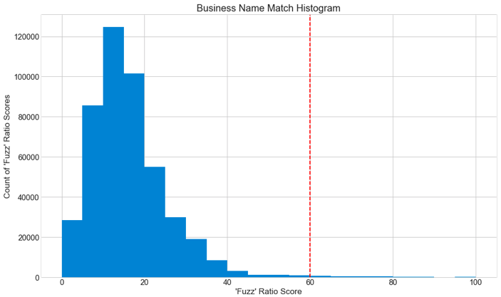
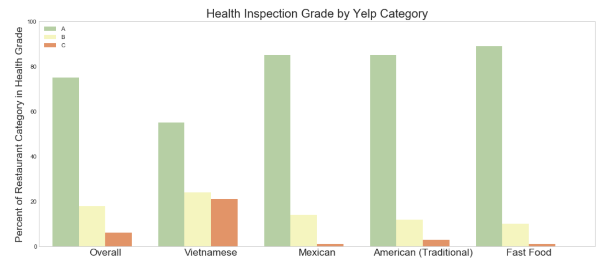
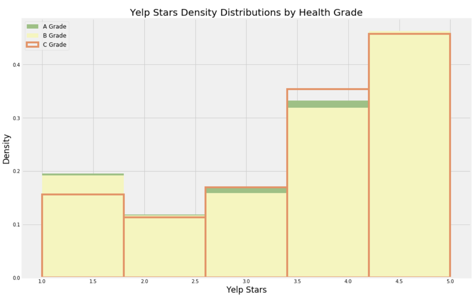
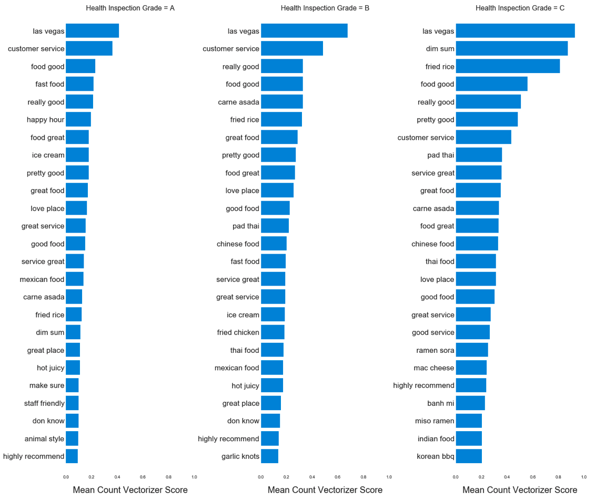

# Predicting Health Inspection Grades with Yelp Data

## Motivation & Background
Restaurants and establishments serving any food undergo routine health inspections far more often than what you might think. Providing health inspectors with a live indicator of restaurants that might be at risk of a health violation will help health departments use resources.

Additionally, maintaining a high health inspection grade is critical to a business's reputation. Small business owners can better monitor their own cleanliness if they receive some form of feedback between routine health inspections.

Therefore, this project aims to predict a business's health grade given the yelp reviews written since the most recent inspection.

## Data Sources

| Source        | Description           | Format  |
| :-------------: |:-------------:| :-----:|
| [Yelp Dataset](Yelp.com/dataset)     | 11 million Yelp reviews with corresponding business and user information | SQL|
| [Southen Nevada Health District Inspections](http://www.southernnevadahealthdistrict.org/restaurants/inspect-downloads.php)     | 225,753 health inspections with corresponding establishment data      |  CSV  |

*Yelp data was filtered down to businesses and reviews in NV.

## Methodology

## Combining Data Sources
Merging the Yelp and county data bases proved to be the most challenging part of this project so far. While the different sources have shared column names, they are not exactly aligned. Initially, merging was implemented on longitudinal data, but truncating or rounding the different float datatypes resulted in an extremely low match rate.

A reasonable match rate was achieved by the following process:
- Stripping all non-digit characters from the establishment address fields in both datasets
- Merging datasets based on the new stripped address fields
- Calculating a [Fuzz Ratio Score](http://chairnerd.seatgeek.com/fuzzywuzzy-fuzzy-string-matching-in-python/) for each row for using the Yelp establishment name and the county establishment fields
- Filtering the dataset to only businesses that had a fuzz ratio score of 60 or above.
  - A threshold of 60 was chosen by looking at data samples and evaluating how well of a match the different scores were.

This process can be found in the raw_data_to_pickle.py script's make_mapper function.

Below are three examples of how this process looks. Notably, restaurants with the same address number on different streets would be merged, but would not be included in the final dataset because of a low fuzz score. The histogram shows the distribution of all fuzz scores after the merge on address digits. The red-dashed line represents the threshold for being in the final data set.

| Yelp Address        | County Address   | Stripped Address  | Yelp Name | County Name | Fuzz Score |
| :-------------: |:-------------:| :-----:|:-------------:|:-------------:|:-------------:|
| 2343 W Gowan Rd,Ste B      | 2343 W Gowan Rd B | 2343 | Foothills Tavern | Foothills Tavern | 100|
| 2544 E Desert Inn Rd      | 2544 E Desert Inn Road | 2544 | Stick E Rice | Stick E Rice Thai Restaurant | 60|
| 4170 Pioneer Ave, Ste A      | 4170 S Fort Apache Rd | 4170 | Plumbing Solutions- Nevada | Original Pancake House | 30|

Now that the two databases have a "map," it's an easy process to put yelp business ids on county inspection periods and group the review text by health inspection period. This process can be found in the raw_data_to_pickle.py script's match_reviews_and_inspections function.

Ultimately, this methodology matched 1,991 business between the two sources. Those business resulted in 105,465 yelp reviews, which bundle into 10,827 health inspection periods. This is the dataset that will be used for analysis.

## Analysis

With the two databases now communicating with one another, visualization by health grades is simple. Below is a bar chart of Yelp category health inspection grade percentages. The county data only has broad categories like 'restaurants' or 'grocery stores.' Being able to further categorize restaurant types is helpful. Initially, it looks like Yelp category can do a good job of explaining health inspection grade. However, my current working model does not include categories because including them greatly lowered the performance. This could because of the number of yelp categories. In the future, I'd like to determine which categorical dummy variables to include.

 This chart also show how imbalanced the dataset is between A, B, and C health inspection grades. For modeling later on, the data was simplified to only predict A (1) or not A (0).

 Lastly, this chart shows that you might want to avoid the pho in Vegas.

By looking at the Yelp review stars (charted below), it seems that the stars do not vary significantly by health grade. However, after running chi-squared tests on the different distributions, it's clear that there is some significant differences between A-grade stars and C-grade stars. The chi-squared p-values are below the histogram. Remember- a chi-squared test assumes the distributions are identical. The p-value communicates the probability of seeing that result (or more extreme) given that assumption is true. So, a small p-value expresses that the distributions, in fact, are not identical. Given the results, you can see that A and C-grade starts are not similar. But, A vs B and B vs C are harder to distinguish.

Curiously, the differences between A and C appear to be the opposite of what you might expect. The mean star rating for A-grade restaurants is 3.59. C-grade is 3.72. B-grade is 3.64. This anomaly could be due to the small number of C reviews, but could also be a representative sample. In which case, it is surprising that C-grade restaurants, on average, receive higher yelp star ratings.

| Health Grade Comparison        | Chi-squared p-value|
| :-------------: |:-------------:|
|A vs C     | 0.02 |
| A vs B     | .99      |
| B vs C| .99  |

## NLP Modeling
With the grouped review text by health inspection period, I vectorize the strings using bi-grams and use the features in a Random Forest Classifier model. The chart below shows the top bi-grams for each health grade. This process can be found in the raw_data_to_pickle.py script's HealthClassifier class.

Before settling on this model, gradient boosting was tested, but proved to be too overfit. On first glance, the bigrams look extremely similar. Words like "really good" and "food good" appear in each category as a top word pairing. However, it is interesting that "fast food" and "animal style" appear only in Grade-A. A reasonable explanation for this is that chain restaurants have a brand and reputation built around cleanliness. People choose these restaurants because they know the experience they'll have. Similarly, restaurant types that tend to be local appear more frequently in grade-C. Chi-squared results for nlp feature selection are included in the .ppt file in this repo. In addition, highlights of correctly predicted C-grade reviews are included in the same file.

The current-working model has a precision of .81 and recall of .83 on a test train split of .8/.2.

The raw_data_to_pickle script goes from raw data to a pickled model (transforming the data) using all data available. The predict_one.py script unpickles the model and predicts a health rating from the contents of a text file. In an effort to see how the model performs on a different city's data, I found a restaurant with a low health rating (36/100) in Austin, and put its recent Yelp reviews in a text file. The model predicts that it would not receive an A-grade.

## Next Steps
- Collect data from more cities for training
- Feature selection on Yelp categories
- Predict health grade instead of 'A' or 'not A'
- Build app that allows the user to see the predicted health grade by entering a business's Yelp URL

## Acknowledgements
Thanks to my instructors, peers, and members of the [Galvanize](https://www.galvanize.com/austin) community for the support and brainstorming for the duration of this project.
